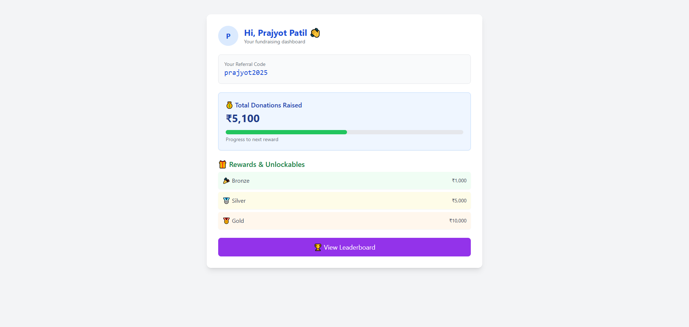
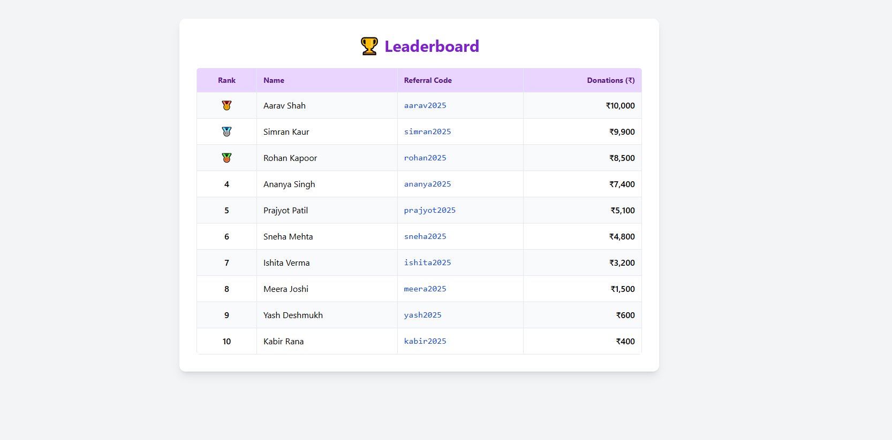

Here’s a clean and informative **`README.md`** file for your GitHub repo based on your project setup:

---

````md
# 🌟 SheCan Foundation Intern Dashboard

This is a full-stack dummy application for SheCan Foundation interns to track donations, rewards, and rankings via referral codes.

## 🧩 Project Structure

- **Frontend**: React (Vite)
- **Backend**: Node.js + Express
- **Dummy Data**: Stored in a local file (`data/interns.js`)

---

## 🚀 Features

- ✅ Dummy Login with fixed credentials
- 📊 Dashboard showing referral info and rewards
- 🏆 Leaderboard sorted by donations
- 🔐 Client-side route handling with React Router
- 📦 API fetching via Axios

---

## 🛠 Tech Stack

| Frontend    | Backend       | Others        |
|-------------|---------------|---------------|
| Vite + React | Express (Node.js) | Tailwind CSS |
| Axios       | Dummy JSON API | Render (Backend Hosting) |
| React Router |               | Vercel (Frontend Hosting) |

---

## 🔧 Installation

### 1. Clone the repo

```bash
git clone https://github.com/prajyotpatilll/assignment.git
````

### 2. Backend Setup

```bash
cd backend
npm install
npm run server
```

Server runs on: `http://localhost:5000`

### 3. Frontend Setup

```bash
cd frontend
npm install
npm run dev
```

App runs on: `http://localhost:5173`

---

## 🧪 Dummy Login Credentials

```
Email: xyz@gmail.com
Password: 12341234
```

---

## 📡 API Endpoint

* `GET /api/intern` – returns all intern data

---


## ✨ Screenshots

## 📸 Screenshots

### 🧑‍💻 Dashboard


### 🏆 Leaderboard



---

## 📁 Folder Structure

```
.
├── backend
│   ├── controllers
│   ├── routes
│   ├── data
│   ├── server.js
│
├── frontend
│   ├── src
│   │   ├── pages (Login, Dashboard, Leaderboard)
│   │   ├── services (api.js)
│   │   └── App.jsx
│
└── README.md
```

---

## 🤝 License

This project is built for educational/demo purposes only.

---

## 🙋‍♀️ Author

